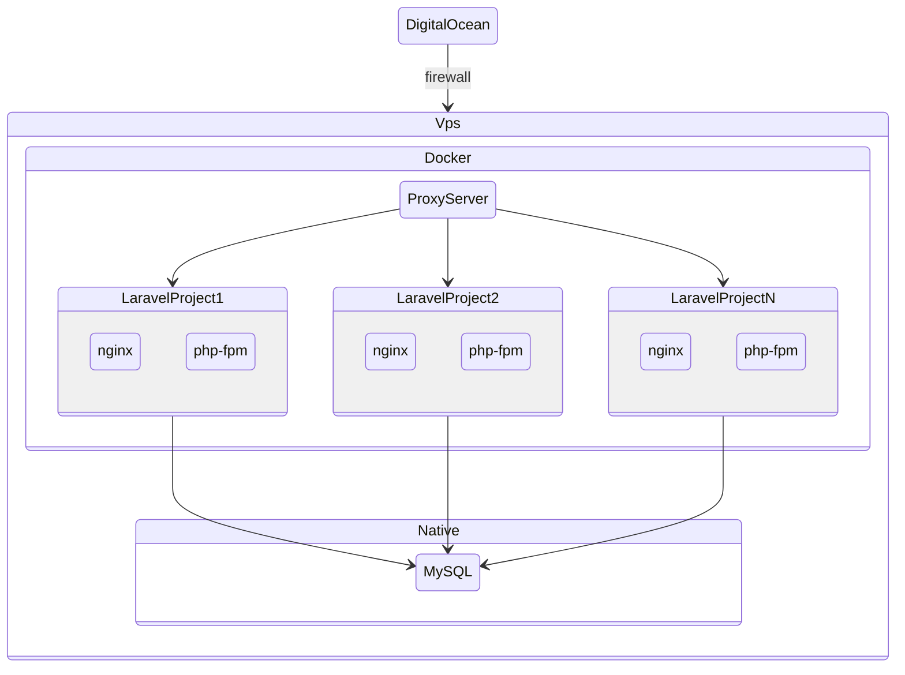

# Docker Proxy Server

## Requirements
- [docker](https://www.docker.com/)

## Installation

1. Clone this repo:
    ```sh
    git clone git@github.com:dedecube/docker-nginx
    ```


2. Create .env file copying .env.example file:
    ```sh
    cp .env.example .env
    ```

3. Create a docker network:
    
    ```sh
    docker network create ${NETWORK_NAME}
    ```
4. Set you NETWORK_NAME into .env file.
   
5. Build docker-compose:
   
   ```sh
    docker compose build
   ```

6. Run docker container:

    ```sh
    docker compose up
    ```

    > Optionally, you can add `-d` flag to run it detached.

## Graph

